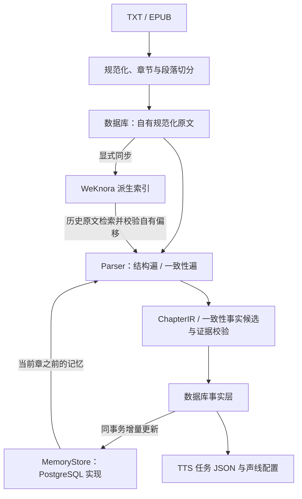

# 解析、证据与记忆闭环

2026-09-29：已接通项目内部的解析闭环。MemPalace、语音合成服务和视频生成服务尚未选定接口，因此不将这些外部集成标记为完成。

## 当前执行链路



原文仍以数据库中的规范化文本为准。WeKnora 是可重建索引；导入与解析不会自动扩大远端同步范围或删除远端文档。实际 PostgreSQL 与本地 PGlite 共用此链路。

## 已实现

- `ParserRetrieval` 在进程入口构建，CLI 的 `parse`、`parse-consistency`、`preview-consistency` 以及 API 内置队列、BullMQ 独立 worker 均传递同一套检索依赖。凭据与客户端对象不会写入 Redis 任务数据。
- LLM 结构遍和一致性遍调用 `recallState`、`recallSimilar`，并在配置 WeKnora 后检索原文。启发式结构遍不调用远端服务。一致性遍配置了 embedding 时也使用现有场景向量索引。
- 记忆限定同书同版本，截止到当前章的前一章。状态和伏笔查询按当时的有效区间还原，后文发生的变化不会抹掉旧章的历史上下文。记忆关键词匹配使用中文分词。
- WeKnora 结果必须属于目标版本已映射的文档，索引哈希必须与当前原文一致，文本必须在章节中唯一定位，而且章节必须早于当前章。检索结果携带自有 `editionId/chapterId/charStart/charEnd/quote`，chunk ID 仅作二级指针；歧义、过期、跨版本与后文章节结果丢弃。
- pgvector 的版本和章节条件在数据库排序、数量限制之前执行。WeKnora 目前从最多 50 个远端候选中筛出最多 10 条有效历史证据，因此大量后文命中仍可能导致历史召回不足；本地过滤保证不会将后文送入上下文。
- 上下文统一按预算装配，包括 JSON 字段及证据元数据的开销；默认预算 3000。候选过多或单条过长会被省略，预览返回 `omitted`。记忆与历史原文仅用于理解，提交事实仍必须精确引用本章原文。
- `commitConsistencyFacts` 在同一事务中更新事实、派生记忆以及解析成功状态；状态替换、关系替换和伏笔解决同时刷新旧记忆的有效区间。投影写入失败会回滚整次提交。手动重建、事实写入和失效清理按书的数据库行锁串行执行。
- 重解析或重新导入使一致性事实失效时，对应版本的记忆仍会清空。重新生成事实后自动恢复这些事实的记忆，无需每章运行重建命令。

## 使用顺序

先导入，按选定范围显式同步 WeKnora，并确认远端异步解析已完成。然后完成目标范围的结构遍，再按顺序运行一致性遍；结构遍重写会使整个版本的一致性结果失效，因此不要交替执行每章的结构遍和一致性遍。

```bash
pnpm cli import novels/示例.txt --title 示例
pnpm cli sync-weknora <editionId> --from 1 --to 3

# 远端解析完成后，可重跑同范围同步以回填二级指针。
pnpm cli parse <editionId> --from 1 --to 3 --attributor llm
pnpm cli parse-consistency <editionId> --from 1 --to 3 --budget 3000

# 已有事实的旧数据库可以一次性补建记忆，无需重跑模型。
pnpm cli memory-rebuild <bookId>

# 在已有结构上检查新上下文与候选，不提交事实或记忆。
pnpm cli preview-consistency <editionId> 3 --budget 3000
```

同步范围的既有约束与异步解析说明见 [检索层](10-knowledge.md)。未配置 WeKnora 或目标版本没有 KB 映射时，只使用本地上下文；已配置服务的请求失败会让该章报错，不伪装成成功的空检索。

提示词版本更新为 `structure-pass/0.4`（仍组合引号抽取版本）与 `consistency-pass/0.5`，旧版本评测数字不代表新版本质量。已有一致性事实依然受防覆盖保护，应先用只读预览检查；本次代码修改不会自动重跑真实小说。

## 外部集成待办

1. MemPalace：待确定仓库/版本与实际 API 或 MCP 契约后，实现 `MemoryStore` 适配器及事实提交后的可重试外部同步。数据库事实层仍是唯一真相，外部同步不能造成重复事实提交。
2. TTS：待确定合成服务后，将已有任务与角色声线接入合成、重试和音频产物保存。
3. Video：待确定生成服务与输入规格后，实现从已存场景/角色/事件到视频任务和产物的链路。

这些接口尚未确定，本次不构造占位 HTTP 接口，也不宣称完成外部服务联调。

## 验证记录

本次 `pnpm test -- --maxWorkers=4`：49 个测试文件通过，415 项测试通过、5 项按环境条件跳过（Redis 集成）。新增测试覆盖检索映射/歧义/过期/未来章节过滤、跨章记忆反馈、向量检索范围、历史状态还原、只读预览及记忆失败时的事务回滚。`pnpm typecheck` 通过后端 TypeScript 与前端 Vue 类型检查；修改过的 TypeScript 文件已格式化。

数据库测试使用内存 PGlite，模型与 WeKnora 使用测试替身。没有修改真实小说数据，也未验证真实 PostgreSQL 并发、真实模型质量或新解析链路的远端端到端行为。
